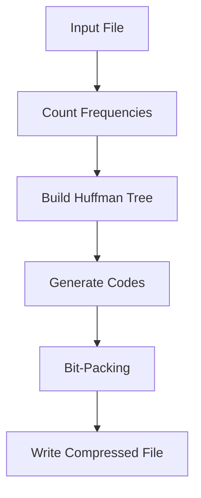
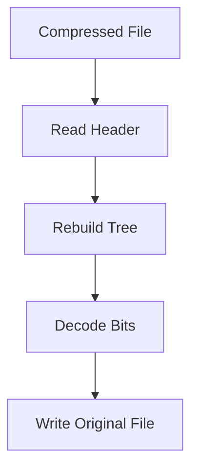

# Huffman Compressor 

**Huffman Coding Compressor** built in C. It’s a neat tool to shrink text files by giving shorter codes to frequent characters. Think of it as a digital zipper for your files—lossless.

---

## What’s This About? 

Huffman Coding is a classic algorithm that compresses data by assigning variable-length codes based on how often each character appears. More frequent = shorter code. This project lets you:
- **Compress** any file into a smaller binary version.
- **Decompress** it back to the original, bit for bit.

Perfect for text files with lots of repeating patterns!

---

## How It Works  

Here’s the flow (Compression and Decompression) , visualized with a quick graph:
### - Compression:

Example 
```sh
# Compress text.txt → compressed.huff
Operation: c
Input: text.txt
Output: compressed.huff
```
### - Decompression:

Example
```sh
# Decompress compressed.huff → output.txt
Operation: d
Input: compressed.huff
Output: output.txt
```

# How to Use

### 1. Compile using gcc compiler 
```sh
gcc huffman.c -o huffman
```
### 2. Run the Program
```sh
./huffman
```
### 3. Follow Prompts
- `c` = Compress | `d` = Decompress
- Enter input file (must exist)
- Enter output file (directory writable)

  ## Outputs
   Sample Outputs [https://tanishx1.github.io/web-result/file%20compression/index.html]
